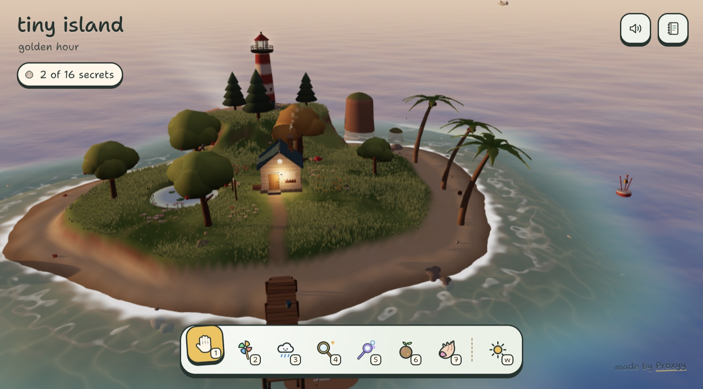
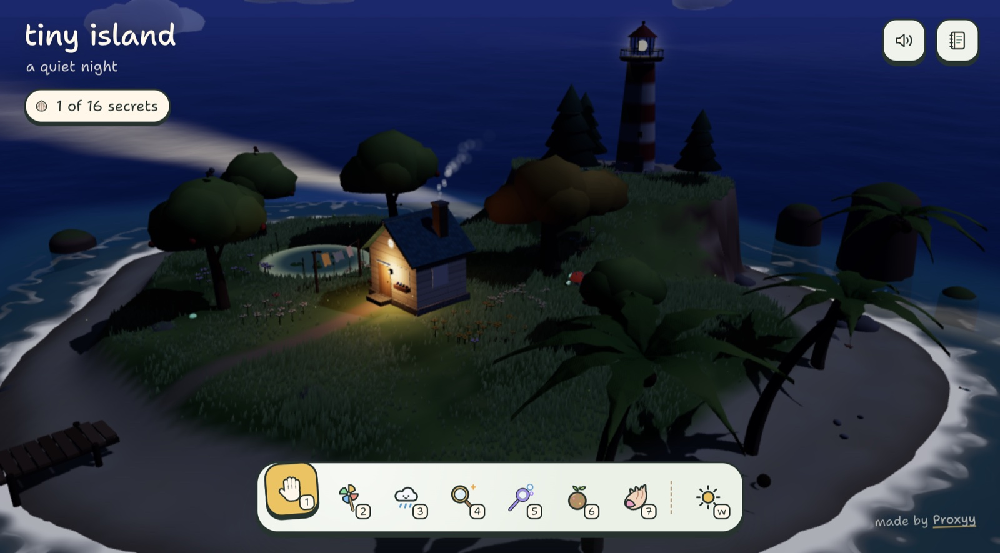
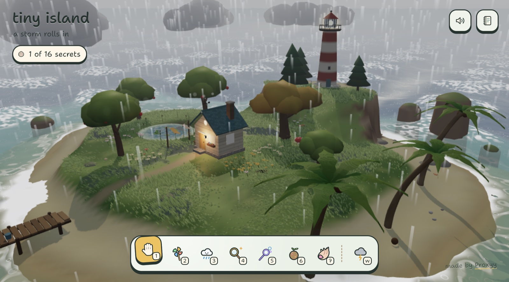
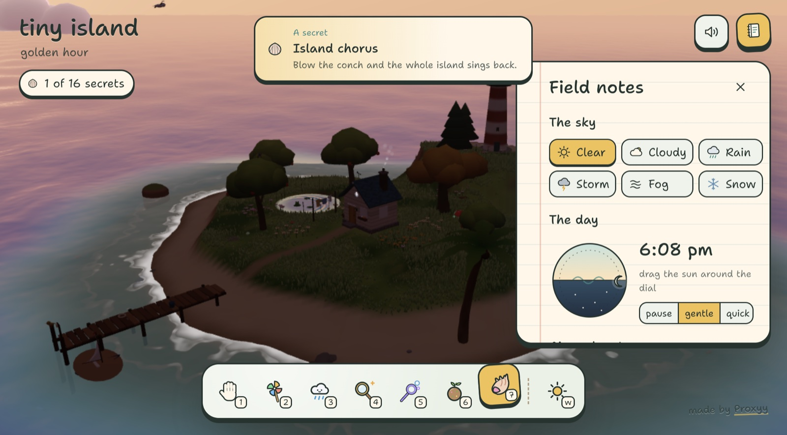

<div align="center">

# tiny island

**A small, hand-made 3D island to poke at.**

Shake the trees, skim pebbles, blow bubbles for the fish, rain on the flowers,<br>
and slowly uncover the island's sixteen secrets.

[](LICENSE)
[](https://nextjs.org)
[](https://threejs.org)
[](https://r3f.docs.pmnd.rs)



</div>

## What is it?

Tiny Island is a cosy toy, not a game. There's no score and no timer, just a little world that reacts to you. Days pass, weather rolls in, birds come and go, and things happen when you're curious enough to try them.

Everything you see is generated in code: no 3D models, no image textures, no audio files. The terrain, trees, cabin, creatures, sky, water and every sound are built procedurally when the page loads.

<table>
  <tr>
    <td></td>
    <td></td>
  </tr>
  <tr>
    <td align="center"><sub>Nights have a lighthouse, fireflies and a glowing sea</sub></td>
    <td align="center"><sub>Weather changes everything, from the waves to the wildlife</sub></td>
  </tr>
</table>

## Features

- **A living island.** Fish, birds, crabs, a frog, a rabbit, butterflies, fireflies and the occasional whale, each with their own little routines.
- **Real physics.** Pick up pebbles, shells and coconuts and throw them. They bounce off the cabin roof, roll down hills, skim across the sea and float. Collisions are powered by [Rapier](https://rapier.rs).
- **Seven tools.** Stir the wind, rain on things, beam sunlight around, blow bubbles, plant flowers and call out to the island.
- **Day, night and weather.** A full day cycle you can scrub by hand, plus clear, cloudy, rain, storm, fog and snow.
- **Sixteen secrets** to discover, tracked in your field notes and saved between visits.
- **Procedural sound.** Waves, wind, rain, birdsong and every pop and splash are synthesised live with the Web Audio API and placed around the camera.
- **Works everywhere.** Desktop and touch, adapts its resolution to keep a smooth frame rate, and respects reduced-motion and notched screens.

## How to play

| | Desktop | Touch |
| --- | --- | --- |
| **Look around** | drag | two-finger drag |
| **Zoom** | scroll | pinch |
| **Fly somewhere** | double-click (the sky flies you home) | double-tap |
| **Pick up and throw** | drag a pebble, shell or coconut | same |
| **Poke things** | click | tap |

### Tools

Pick a tool from the basket at the bottom of the screen, or press its number key.

| Key | Tool | What it does |
| :-: | --- | --- |
| `1` | Hand | poke, grab and throw |
| `2` | Pinwheel | sweep to stir up the wind |
| `3` | Pocket cloud | hold to rain where you point |
| `4` | Sun mirror | hold to cast a beam of light |
| `5` | Bubble wand | hold and sweep to blow bubbles |
| `6` | Seed bomb | tap to toss a ball of seeds |
| `7` | Conch | tap to call out to the island |

### Keyboard

| Key | Action |
| :-: | --- |
| `W` | cycle the weather |
| `J` | open or close the field notes |
| `M` | mute or unmute |
| `Esc` | put the tool down, or close the field notes |
| `←` `→` | move the sun when the day dial is focused |



### Secrets

Your field notes keep track of what you've found. Some clues to get you started:

1. Something in the sky can be held.
2. Watch the shoreline.
3. Some seeds want rain, sun and company.
4. Someone in the lagoon is hungry, and loves bubbles.
5. The lighthouse talks to the deep at night.
6. Patience is rewarded.
7. Reach for the moon.
8. Look out to sea when the weather turns.
9. The sea keeps late hours.
10. Throw low and fast.
11. Wait for the rain to clear.
12. A bud on the cliff is thirsty after dark.
13. Clouds don't like to be poked.
14. Throw something at the big mushroom.
15. Call out when everyone is awake.
16. Even a small cloud has a temper.

<details>
<summary><b>Spoilers: how to find every secret</b></summary>

<br>

| Secret | How |
| --- | --- |
| Time keeper | Grab the sun (or the moon) and drag it across the sky. |
| Message in a bottle | Wait for a bottle to wash up on the beach, then tap it. |
| The lantern tree | Plant the seed from the bottle, then give it rain, sunshine and some company. |
| Golden fish | Feed the sea fish: drop food in the water or blow bubbles low over the sea for them to leap at. Enough helpings and a golden fish appears. |
| Old friend | Tap the lighthouse three times in quick succession at night to call the whale. |
| A quiet visitor | Stay still for a while and a rabbit comes out. |
| A wish | Tap the moon to send a shooting star. |
| The ship in the storm | During a storm, find the ghost ship on the horizon and keep it in view for a few seconds. |
| Midnight tide | At midnight, touch the sea and it glows. |
| Stone skipper | Throw a pebble low and fast so it skims the sea three times. |
| After the rain | Let the sun come out after rain for a rainbow. |
| Moonflower | Water the pale bud by the lighthouse at night. |
| Short temper | Keep poking a raining cloud until it throws lightning. |
| Boing | Throw something onto the big red mushroom. |
| Island chorus | Blow the conch while the island's creatures are awake, so at least three of them answer. |
| Storm in a pocket | Keep the pocket cloud raining long enough and it starts to crackle. |

</details>

## Running locally

You'll need [Bun](https://bun.sh) 1.3+ (or Node 20+ with npm) and a browser with WebGL 2.

```bash
git clone https://github.com/wannabeOSS/opus-tiny-island.git
cd opus-tiny-island
bun install
bun dev
```

Then open [http://localhost:3000](http://localhost:3000).

| Command | What it does |
| --- | --- |
| `bun dev` | start the dev server with hot reload |
| `bun run build` | create a production build |
| `bun start` | serve the production build |
| `bun run lint` | run ESLint |

The island is a fully static page, so the production build can be deployed to any static or Node host (Vercel, Netlify, Cloudflare and so on).

## How it's built

| Layer | Tech |
| --- | --- |
| Framework | [Next.js 16](https://nextjs.org) (App Router, Turbopack) and React 19 |
| Rendering | [three.js](https://threejs.org), [React Three Fiber](https://r3f.docs.pmnd.rs) and [drei](https://drei.docs.pmnd.rs) |
| Physics | [Rapier](https://rapier.rs) via [@react-three/rapier](https://github.com/pmndrs/react-three-rapier) |
| Audio | Web Audio API, all synthesised |
| Styling | CSS Modules |

### Project layout

```
app/                     Next.js entry: layout, metadata and the page
components/island/
├── TinyIsland.tsx       top-level component: scene, HUD and cursor
├── Experience.tsx       the canvas, adaptive resolution and scene graph
├── systems/             camera rig, tool input, sound mixing, director (time and weather)
├── world/               terrain, water, flora, cabin, lighthouse, props, sky toys
│   ├── creatures/       fish, birds, bugs, critters, whale
│   └── effects/         pooled particle systems
├── lib/                 shared state, terrain maths, audio engine, colliders, secrets
└── ui/                  HUD, field notes, custom cursor, error fallback
docs/screenshots/        images used in this README
```

### A few ideas that hold it together

- **One shared world.** `lib/world.ts` holds a plain mutable `world` object (time, weather, wind, pointer and so on) plus a tiny event bus (`on` / `emit`). Systems read from it every frame instead of passing props around, which keeps the render loop free of React re-renders.
- **Everything is procedural.** Geometry is built from code (`lib/geo.ts`), textures are drawn on canvases (`lib/textures.ts`), and terrain height is a pure function (`lib/terrain.ts`), so the same maths drives both the visuals and the physics.
- **Physics only where it matters.** Rapier handles the throwable props. The colliders in `lib/colliders.ts` are convex hulls shaped like the visible objects, and creatures use cheaper hand-written movement.
- **Built for 60 fps.**
  - The canvas resolution adapts to the frame rate.
  - The water shader skips work on calm seas.
  - Particles and instanced meshes upload only what changed.
  - The number of lights never changes at runtime, so nothing triggers a shader recompile mid-play.

### Debugging

In development, `window.__island` exposes the world state and a few helpers in the browser console:

```js
__island.world.time = 22;              // jump to night
__island.emit("weather", { kind: "storm" });
__island.addRipple(5, 10, 1);          // splash the sea at (x, z)
```

## Contributing

Issues and pull requests are welcome, whether that's a bug fix, a new creature, a new secret or a performance improvement.

1. Fork the repo and create a branch.
2. Make your change and check it in the browser on both desktop and a phone-sized window.
3. Run `bunx tsc --noEmit` and `bun run lint` and make sure both pass.
4. Open a pull request describing what changed and how to see it.

Some house rules that keep the island fast and stable:

- **No asset files.** New things should be generated in code, like everything else.
- **No allocations in `useFrame`.** Reuse module-level vectors instead of creating new ones every frame.
- **Don't add or remove lights at runtime.** Keep them mounted and set their intensity to 0 instead, otherwise every material recompiles.
- **Keep randomness out of render.** Use seeded randomness (`mulberry32`) or module scope; React's purity rules will flag `Math.random()` in render.
- **Match the tone.** The island is gentle: soft colours, small surprises, nothing loud or punishing.

## License

[MIT](LICENSE) © Proxyy. You're free to use, change and share this project; just keep the copyright notice.

## Credits

Made by **[Proxyy](https://github.com/wannabeOSS/opus-tiny-island)**.

Built on the shoulders of [three.js](https://threejs.org), [React Three Fiber](https://github.com/pmndrs/react-three-fiber), [drei](https://github.com/pmndrs/drei), [Rapier](https://rapier.rs) and [Next.js](https://nextjs.org).
